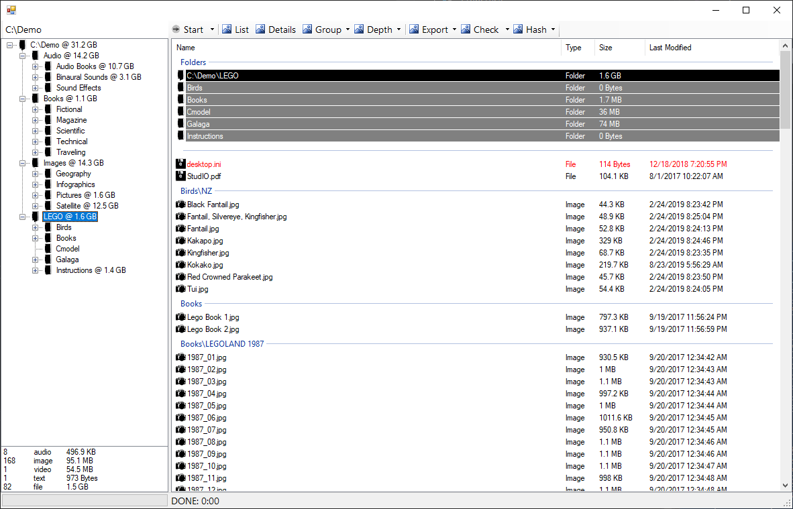

# Navigator `.NET Framework, C#, WinForms`

## Generate and browse snapshots of file metadata (size/date/etc)

Lookout is a simple Windows Forms application to visualize a file system tree while providing functionality to recursively flatten and regroup the files contained in a directory and its subdirectories.

[Browse Source Code](../../Expedition.Win.NavTree)

### Features

* Recursively load a directory to summarize all file contents
* Display file system structure in Tree View and List View
* Flatten file list for all subdirectories of selected directory
* Display file count and total size by media type
* Group file list by media type or subdirectory
* Export file system data to text or CSV
* Generate md5 hash file for contents

