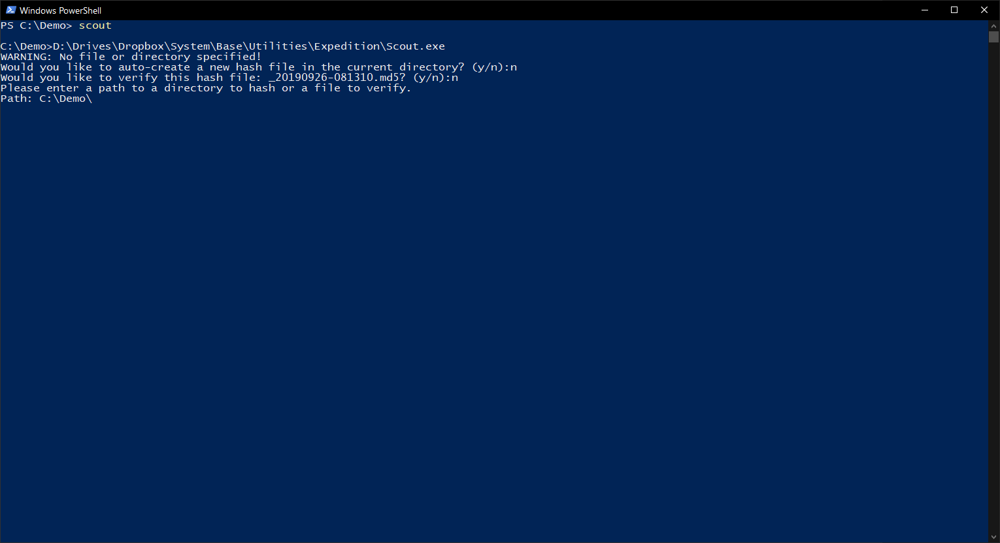
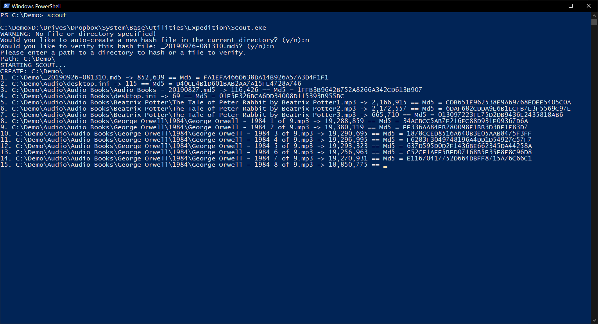
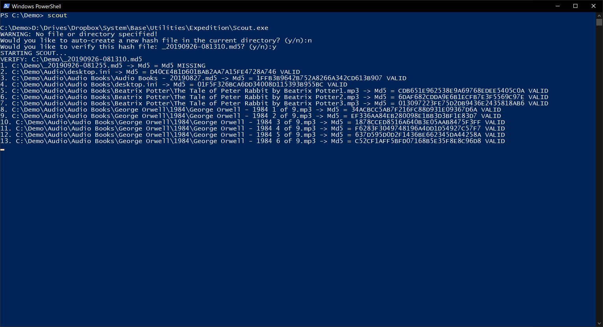
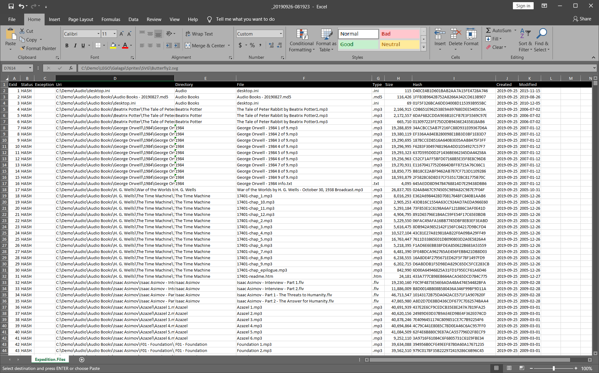

# Scout `.NET Framework, C#, Console`

## Create/verify md5 and sh1 file content hashes from the command line

[Browse Source Code](../../Expedition.Cmd)

### Usage

Execute `Scout.exe` from the command line and follow prompts

#### Switches

`/sha1`	Uses the sha1 hash and file output type (-1)

`/abolute` Creates absolute file paths in hash file (-a)

`/preview` Executes the request without generating hashes (-p)

`/report` Ouputs detailed summary after hash creation or verification (-r)

#### Examples

```
Scout.exe		Prompts to verify any/all md5|sha1 files in current directory then prompts to create a new md5 file of current directory

Scout.exe .		Auto-creates a new md5 file of the current directory
Scout.exe C:\Folder\	Creates a new md5 file of the specified directory relative to the current directory

Scout.exe /md5		Creates a recursive md5 hash file for everything in current directory
Scout.exe /sha1		Creates a recursive sha1 hash file for everything in current directory

Scout.exe File.md5	Verifies an existing md5 file against relative to current directory, prompt to create if does not exist
Scout.exe File.sha1	Verifies an existing sha1 file against relative to current directory, prompt to create if does not exist
```

##### Default Prompts


##### Create MD5 Report


##### Verify MD5 Output


##### Sample Excel Report [(Download)](./Report-Example.xlsx?raw=true)

