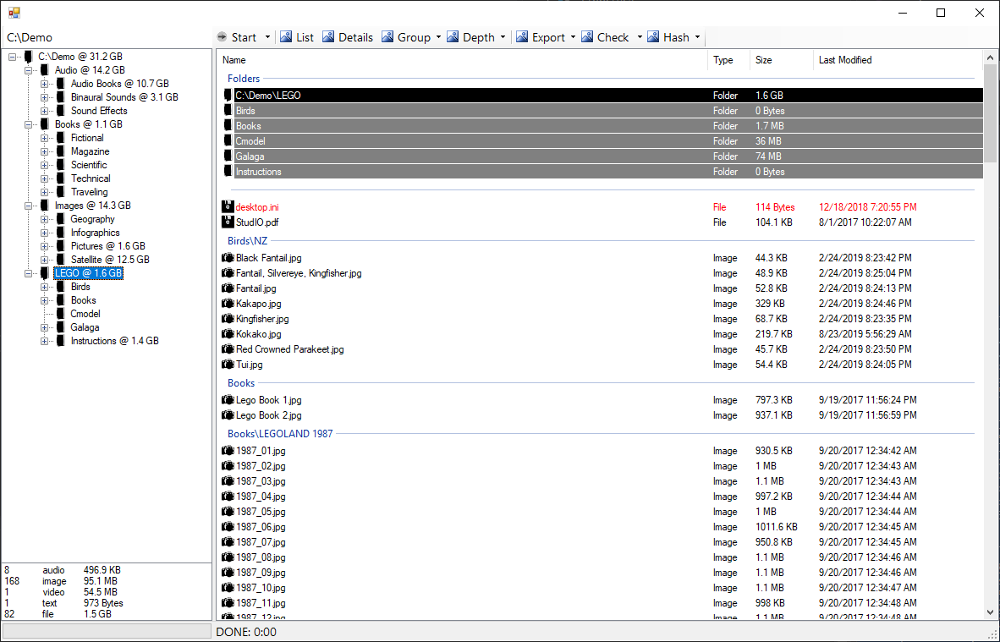

# Expedition `.NET Framework, C#, Console, WinForm`

## A simple set of applications to take a snapshot of a file system and create or verify md5/sh1 file hashes

### [Scout](./Documentation/Scout/README.md)
Create and/or verify md5 and sh1 file content hashes from the command line.

### [Lookout](./Documentation/Lookout/README.md)
Manage creation and verification output with simple Windows user interface.

#### Work in progress

##### Navigator
Load and save snapshots of file metadata (size/date/etc) for offline backups.

##### Commander
Compare file system snapshots against each other or to current live file data.
